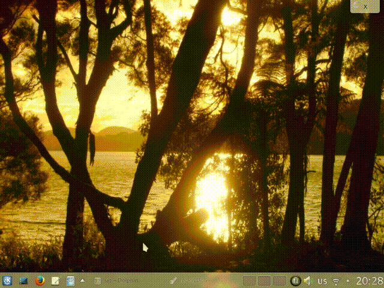

luckyLUKS
=========
luckyLUKS is a Linux GUI for creating and (un-)locking encrypted volumes from container files. Unlocked containers leave an icon in the systray as a reminder to close them eventually ;) Supports cryptsetup/LUKS and Truecrypt container files.

luckyLUKS was brought to life to offer an equivalent to the Windows TrueCrypt application. Although most Linux distributions provide excellent support for encrypted partitions these days - you can choose to run from a completely encrypted harddrive on installation with one or two clicks - the situation with encrypted containers is not that great. An encrypted container is basically a large file which encapsulates an encrypted partition - this approach has some advantages, especially for casual computer users:

- No need to deal with partition table wizardry when creating an encrypted container, you basically create a file on a harddrive, it doesn't matter if its an internal one or an external usbstick etc..
- Backup is straightforward as well, just copy the file somewhere else - done! No need to backup your precious data unencrypted
- You can easily add some encrypted private data to an unencrypted external harddrive you want to share with friends or take with you while travelling
- Lots of users are already quite familiar with all this, because their first touch with data encryption has been TrueCrypt which uses the encrypted container approach

luckyLUKS follows a keep-it-simple philosophy that aims to keep users from shooting themselves in the foot and might be a bit too simple for power users - please use `ZuluCrypt <https://code.google.com/p/zulucrypt/>`_ and/or `cryptsetup <https://code.google.com/p/cryptsetup/>`_/`tcplay <https://github.com/bwalex/tc-play>`_ on the command line if you need special options when creating new containers. On the other hand, to unlock existing containers luckyLUKS offers all you need and the possibility to create a shortcut to a container in your start menu or on the desktop. From the shortcut its just one click and you can enter your password to unlock the container. For technical details please see the FAQ at the end of this page. For a first impression:

Installation
============

For Ubuntu and derivates just use this ppa::

    > sudo add-apt-repository ppa:jas-per/lucky-luks
    > sudo apt-get update && sudo apt-get upgrade
    > sudo apt-get install python-luckyLUKS

For other debian based distributions download this debian package and install manually:

`python-luckyluks_1.0.1-1_all.deb <https://github.com/jas-per/luckyLUKS/releases/download/v1.0.1/python-luckyluks_1.0.1-1_all.deb>`_

On other distriubutions you can use the following zip-packaged python file:

`luckyLUKS-1.0.1 <https://github.com/jas-per/luckyLUKS/releases/download/v1.0.1/luckyLUKS-1.0.1>`_

This file contains all resources and can be executed directly by the python intepreter. Place in :code:`/usr/bin` and change ownership to root::

    > sudo mv luckyLUKS-1.0.1 /usr/bin/
    > sudo chown root:root /usr/bin/luckyLUKS-1.0.1
    > sudo chmod 755 /usr/bin/luckyLUKS-1.0.1

Then start with :code:`luckyLUKS-1.0.1` on the command line and create a desktop shortcut manually.

Dependencies
------------

To run luckyLUKS, make sure you have the following installed:

- :code:`cryptsetup`
- :code:`sudo`
- :code:`python-qt4`
- :code:`python-setuptools`
- :code:`tcplay` (if you want to use TrueCrypt containers)

When using the ubuntu-ppa or debian package, these will get installed automatically, if you use the zip-package please install the dependencies manually with your distributions repository tools.

FAQ
===

luckyLUKS is basically a GUI wrapper for two command line tools: `cryptsetup` and `tcplay`. The cryptsetup project has an excellent `FAQ <https://code.google.com/p/cryptsetup/wiki/FrequentlyAskedQuestions>`_ that explains the underlying cryptography and security in great detail. If you want to know more e.g. about choosing a secure password or further protecting your computer, please read the cryptsetup FAQ first. The following information mainly refers to questions specific to encrypted containers and luckyLUKS as a graphical interface to cryptsetup and tcplay.

Backup
------

There is a whole chapter in the cryptsetup FAQ dealing with backup details. This is because cryptsetup is normally used for encrypted partitions, which complicates things a bit. Since luckyLUKS uses encrypted containers, backup is rather straightforward - just copy the whole container and you're done. By copying you technically create a clone of the encrypted LUKS container - see section 6.15 in the cryptsetup `FAQ <https://code.google.com/p/cryptsetup/wiki/FrequentlyAskedQuestions>`_ in case you would like to change your passphrase later on.

Sudo Access
-----------

On Linux encrypted containers get mounted as loopback devices by using the device mapper infrastructure. Access to /dev/mapper is restricted to root for good reason: besides managing encrypted containers, the device mapper is also used by the Logical Volume Manager (LVM) and Software RAIDs for example. There have been `kernel patches <https://code.google.com/p/cryptsetup/issues/detail?id=208>`_ to allow device-mapper access without root privileges but unfortunately those have not been merged. The device mapper developers seem to prefer controlling loopback device mounts by integrating cryptsetup into udisks/dbus/udev/policykit/systemd. While this approach can enable fine grained access control in userspace, it also complicates things quite substantially - nowadays it might be possible to use encrypted containers this way, but decent documentation is hard to find. Probably because udisks is explicitly not meant to be used by applications according to their `developers <http://udisks.freedesktop.org/docs/latest/udisks.8.html>`_: "Hence, if an application does not want to tie itself to a specific version of the operating system, it should not use udisks."

So for now accessing the device mapper directly with administrative privileges is needed to use encrypted containers. Almost every Unix systems offers two ways to do this: setuid and sudo. With `setuid <http://en.wikipedia.org/wiki/Setuid>`_ an executable gains elevated privileges directly, while `sudo <http://en.wikipedia.org/wiki/Sudo>`_ is a program used to give elevated privileges to other executables, that can be configured to allow fine grained access control in userspace similar to the policykit framework mentioned above. With both setuid and sudo, it is the application developer's responsibility to take great care that the program running with elevated privileges cannot be used in any malicious way. Popular methods for privilege escalation in this context are buffer overruns, unsanitized environments, shell injection or toctou-attacks.

Because running setuid executables does not require an additional password, setuid is generally considered a security risk and to be avoided whenever possible. There are usually very few (well reviewed) setuid binaries on a modern Linux system. Sudo on the other hand requires the user's password, has a long record of security-conscious development and lots of flexibility in its access control (e.g.. the *Ubuntu distributions or Apples OSX rely heavily on using sudo for administrative tasks). luckyLUKS uses sudo for all privileged operations and also offers the option to create a sudo-rule to allow the current user to omit their password for running luckyLUKS. Doing so trades some system security for convenience - although luckyLUKS was implemented with security in mind, code reviews are more than welcome!

The last remark on elevated privileges is about luckyLUKS graphical user interface. To minimize the possible attack surface, all UI code is run with normal user rights, while all privileged operations are executed in separate helper processes (privilege separation). 

Is my data/passphrase safe?
---------------------------

This depends more on general computer security issues than on this particular application. In times where you cannot even trust your `hard drive <http://www.wired.com/2015/02/nsa-firmware-hacking/>`_ you have to go a long way to be at least reasonably safe from state-level attackers. If this is a requirement for you, consider using a readonly operating system like `Tails <https://tails.boum.org/>`_ and keep learning about computer security. Sad to say, but a GUI to unlock your encrypted data should be the least of your concerns.

OK, but what about the safety of my passphrase in luckyLUKS compared to using cryptsetup/tcplay directly in a terminal? There are two areas that might be problematic: The first is the standard window system on Unix called X. The X window system originates in a time where the requirements and possibilities of a graphical interface where quite different from what they are now. The security architecture is fundamentally broken from todays point of view. It is for instance not possible to keep other applications from receiving all key-events - which includes the passphrase in our case (keep in mind that this is also true when using cryptsetup in an X-windowed terminal). That said, the successor to X called Wayland is just around the corner, if you feel adventurous you can already use the python3/QT5 version of luckyLUKS in a Wayland only distro like `maui <http://www.maui-project.org/>`_.

The second problem is about keeping the passphrase in memory. In general you `should <http://security.stackexchange.com/questions/29019/are-passwords-stored-in-memory-safe>`_ trust your operating system to restrict memory access. Nevertheless it is good practice to overwrite the data in memory as soon as unneeded while handling sensitive information. Since luckyLUKS is written in Python, direct memory access is not possible, only removing all references to the passphrase and wait for the garbage collection to clean up later. This it not a problem per-se, since you have to trust your operating system anyway, but can turn into a security issue when the memory content gets written to disk on hibernation or into the swapfile. When this happens any sensitive data could still be found in clear text even weeks after the computer was shut down. Easy solution: use `encrypted swap <http://askubuntu.com/questions/248158/how-do-i-setup-an-encrypted-swap-file>`_! And consider using full disk encryption, to make sure nobody with physical access to your computer can e.g.. add a keylogger on startup.

OK, so whats the bottom line? LUKS or TrueCrypt containers are safe, nobody that gets access to such a container of yours will be able to open it without your passphrase. The vulnerable point is the computer you use to access the encrypted data. The degree of vulnerability depends on the resources and determination of an attacker. Furthermore safety is relative to your own needs being a tradeoff between comfort and security. Using luckyLUKS on your daily operating system without any further precautions will still protect your private data against almost all those prying eyes. If you want more certainty use full disk encryption, a live operating system like :code:`Tails` or a computer permanently disconnected from the internet in that order.

Accessing containers on Windows
-------------------------------

If you want to access encrypted containers on Linux and Windows, use NTFS as the filesystem inside the container. It is the only modern filesystem available on Windows and can be used from Linux as well. Since access permissions cannot be mapped from NTFS to Linux user accounts, access to NTFS devices is often not restricted -> take care when using unlocked NTFS devices in a multiuser environment! If you share a computer with other people like family members, always close your encrypted container before switching sessions.

To access LUKS containers from Windows use `doxbox <https://github.com/t-d-k/doxbox>`_ which is based on the now abandoned `freeOFTE <http://sourceforge.net/projects/freeotfe.mirror/>`_. To access TrueCrypt containers use the original TrueCrypt or a successor like `VeraCrypt <https://veracrypt.codeplex.com/>`_. Haven't had time to test this in-depth, for best compatibility its probably easier to create the container with luckyLUKS on Linux.

What about hidden containers?
-----------------------------

All encryption is worthless if you can be `forced <http://xkcd.com/538/>`_ to surrender your keys. In some countries like the UK law enforcement have been given these powers (see `Key disclosure laws <http://en.wikipedia.org/wiki/Key_disclosure_law>`_). Although encrypted data should be indistinguishable from random data, it is quite obvious that huge chunks of random data on your unencrypted harddrive are almost certainly encrypted real data. Hidden containers are not so easily detectable, because they exist inside another encrypted container initialized with random data - there is no way to prove that this hidden container exists, thus giving plausible deniability: You can surrender the key to the outer container and deny the existence of the hidden one, where the real private data is saved.

While this sounds nice and easy in theory, the practical implications to obtain plausible deniability are quite difficult to ensure. Every time you access data inside a hidden container any running application might leak information about its existence, e.g.. thumbnails, last access data, search indexes .. And even if you avoid this by using a read-only operating system like tails, access to the seemingly empty part of your encrypted outer container could still be proven by analyzing e.g. the underlying filesystem or wear-level data from a solid state drive. Further information can be found in the original TrueCryt `documentation <https://veracrypt.codeplex.com/wikipage?title=Security%20Requirements%20for%20Hidden%20Volumes>`_.

Long story short: Hidden containers are not supported by luckyLUKS right now, because you really have to know what you are doing to obtain plausible deniability - learning how to unlock a hidden container on the command line is just a small part of this. On the other hand it would not be difficult to add this feature to luckyLUKS. If you have a scenario where almost plausible deniability would be good enough or if you would like to share your general thoughts on this `issue <https://github.com/jas-per/luckyLUKS/issues/1>`_, please leave some comments.

Translations
============

Providing an easy to use graphical interface instead of relying on command line tools significantly expands the audience for data encryption as TrueCrypt has shown. A graphical interface is only the first step in giving more people the ability to use data encryption on Linux. The next is removing the language barrier from the interface by making the software speak the language the end-user is most comfortable with. The user interface of luckyLUKS is fully translateable, but to offer more translations your help is needed. Since the application is not too complex, it doesn't take long to translate all the neccessary strings. If you want to help out:

- install a translations editor (eg `Poedit <http://poedit.net/>`_) and `python-babel <http://babel.pocoo.org/>`_
- `Download <https://github.com/jas-per/luckyLUKS/archive/master.zip>`_ the source code of luckyLUKS
- Open a terminal, change directory to the location of the luckyLUKS source files
- Create new locale file (eg :code:`make init_locale NEW_LANG="pt"` for Portuguese, see two-letter codes `here <http://en.wikipedia.org/wiki/List_of_ISO_639-1_codes>`_)
- You will find the new locale file in :code:`luckyLUKS/locale/<LANG_CODE>/LC_MESSAGES/luckyLUKS.po`
- Edit this file in the translations editor
- After editing the po file has to be compiled. Poedit can do this automatically: go to :code:`Preferences` and check :code:`Automatically compile .mo file on save`. Or use :code:`make compile_locales` from the source directory.
- To test your translation, start luckyLUKS from the command line. You might have to set the locale explicitly, if your operation system is using a different locale (eg :code:`LANG=pt_PT.utf-8 LANGUAGE=pt ./luckyluks`)

Don't worry too much about previewing messages, since all dialogs resize dynamically. Just make sure the labels in the main windows get displayed nicely. When you are happy with the results, send me the .po-file you created and your translation will get included in the next release. Pull requests are welcome too :)

Bugs
====

Please report all bugs on the github `issue tracker <https://github.com/jas-per/luckyLUKS/issues>`_. Since this is a GUI tool, the most important information is the exact name of the distribution including the version/year and the desktop environment used (eg Gnome, KDE, Mate, XFCE, LXDE). I will try to make sure luckyLUKS works with any recent distribution (from ~2012 on), providing the exact name and version will help reproducing bugs on a virtual machine a lot.
